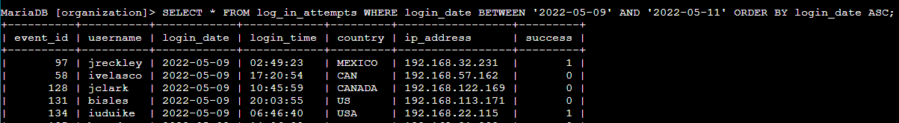
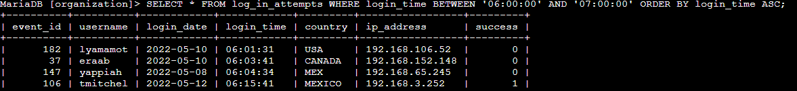
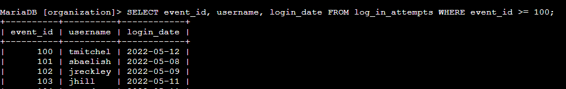
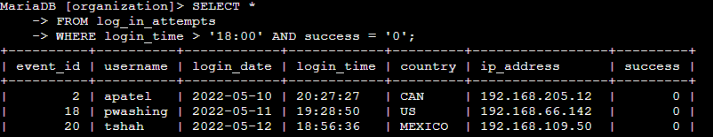
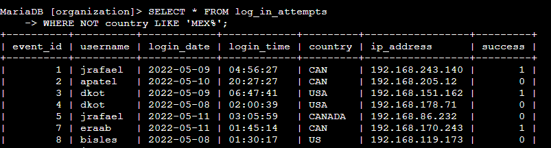
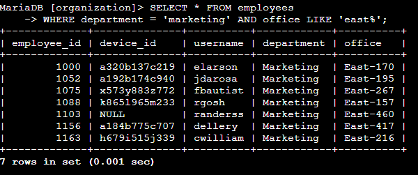

# Google Cybersecurity Certificate - SQL Lab

## Project Description
In this lab, I was tasked with investigating a recent incident in the organization using SQL. The objective was to apply filters to SQL queries to retrieve specific information related to suspicious login activities, failed attempts, and employees needing security updates.

## ⚙️ Lab Steps

### **Step 1: Retrieve Login Attempts on Specific Dates**


A suspicious event occurred on **2022-05-09**. I was asked to review all login attempts on this day and the day before.  
- I executed a query filtering for logins between **2022-05-08** and **2022-05-09**.  
- Added `ORDER BY login_date ASC` to organize the results in ascending order.

 **Query:**
```sql
SELECT * 
FROM log_in_attempts
WHERE login_date BETWEEN '2022-05-08' AND '2022-05-09'
ORDER BY login_date ASC;
```

### ⏰ **Step 2: Investigate Logins Between 6am and 7am**


I was asked to find all login attempts between **06:00:00** and **07:00:00**.  
- Used `BETWEEN` with time ranges and added `ORDER BY` for better readability.

 **Query:**
```sql
SELECT * 
FROM log_in_attempts
WHERE login_time BETWEEN '06:00:00' AND '07:00:00'
ORDER BY login_time ASC;
```

### **Step 3: Track Attempts with High Event IDs**


The security team requested all login attempts with `event_id` greater than or equal to 100.  
- Applied the `>=` operator to filter only the relevant attempts.

 **Query:**
```sql
SELECT event_id, username, login_date 
FROM log_in_attempts
WHERE event_id >= 100;
```

### **Step 4: Find Failed Logins After Business Hours**


I was tasked with identifying all failed login attempts made **after 18:00**.  
- Applied `success = 0` to filter only **unsuccessful** attempts.  
- Used `>` to specify the time range.

 **Query:**
```sql
SELECT * 
FROM log_in_attempts
WHERE login_time > '18:00:00' AND success = 0;
```

### **Step 5: Exclude Logins from Mexico**


The security team wanted to review logins that occurred **outside of Mexico**.  
- Applied the `NOT` operator to exclude Mexico.  
- Used `%` wildcard to cover multiple variations like `MEX` and `MEXICO`.

 **Query:**
```sql
SELECT * 
FROM log_in_attempts
WHERE country NOT LIKE 'MEX%';
```

###  **Step 6: Identify Marketing Employees in the East Building**


I needed to find all **Marketing department** employees in the **East building**.  
- Combined `AND` conditions to filter for both department and building.  
- Used `%` wildcard to include multiple variations.

 **Query:**
```sql
SELECT * 
FROM employees
WHERE department = 'Marketing' AND office LIKE 'East%';
```

---

## 📊 **Skills Learned**
- Applying SQL filters with `WHERE`, `AND`, `OR`, `NOT` operators.  
- Using `BETWEEN` for date and time ranges.  
- Querying with wildcards (`%`) for flexible matching.  
- Sorting results with `ORDER BY` for better readability.  
- Filtering specific employee groups with multiple conditions.

---

## 🛠️ **Commands Used**
```sql
-- Retrieve logins by date range
SELECT * FROM log_in_attempts WHERE login_date BETWEEN '2022-05-08' AND '2022-05-09';

-- Filter logins by time range
SELECT * FROM log_in_attempts WHERE login_time BETWEEN '06:00:00' AND '07:00:00';

-- Filter by high event IDs
SELECT * FROM log_in_attempts WHERE event_id >= 100;

-- Filter failed logins after business hours
SELECT * FROM log_in_attempts WHERE login_time > '18:00:00' AND success = 0;

-- Exclude Mexico logins
SELECT * FROM log_in_attempts WHERE NOT country LIKE 'MEX%'; 

-- Retrieve Marketing employees in the East building
SELECT * FROM employees WHERE department = 'Marketing' AND office LIKE 'East%';
```

---
